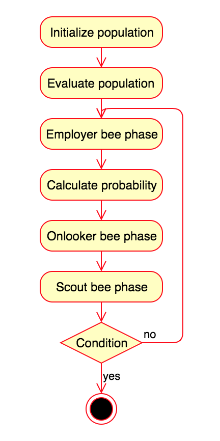

# Summary

A rich body of literature exists regarding the optimization of artificial neural networks (ANN), a method comprised of densely interconnected adaptive processing units [@Hassoun_2009]. This need for optimization arises from a large number of user-set parameters that greatly affect the quality of the ANN’s training. Traditionally, this has been done manually. However, presently with higher computing capacity, it is possible to utilize algorithmic approaches which greatly increase the speed of optimization while enhancing model performance. Commonly used optimization routines include genetic algorithms [@Castillo_2000] and particle swarm optimizations [@Cam_2015]. However, research by Z. Cam et al [@Cam_2015] has shown that an Artificial Bee Colony (ABC) performs best by providing higher accuracy and a shorter run time.

ECabc is an open source Python package based on an Artificial Bee Colony, used for tuning functions such as hyperparameters of artificial neural networks. The method is modelled after the honey foraging techniques of bees, where the search space for  solutions is in as many dimensions as the number of parameters being tuned. The algorithm is outlined in Figure 1.

The algorithm begins with initializing a pre-decided number of bees and running the fitness function for each bee, thus evaluating them. The fitness function is a user defined function that is used to generate the solutions and the error associated with each employer bee's values at a given position. After evaluation, the bees enter the ‘Employer Bee Phase’ during which each bee is moved in one random ‘dimension’ and then reevaluated. If the new position provides a better fitness score, the old position is abandoned and the bee memorizes the new one. This is repeated for every employer bee. Next, ECabc enters the ‘Calculate Probabilities’ state where the fitness scores of all the employer bees are totaled and the best position is memorized. Then a probability is calculated for each bee, which is the bee’s fitness score divided by the total score. The next phase of the algorithm is the ‘Onlooker Bee Phase’, in which employer bees are chosen based on their probabilities, i.e. those with a higher probability will have a higher likelihood of being chosen. The chosen bee is then moved in one dimension and then reevaluated. Again, if the new score is better, the old score is forgotten in favor of it. Every time a bee is moved in one dimension but doesn’t choose the new position, the bee’s counter goes up. Then in the ‘Scout Bee Phase’, if the counter has hit a certain pre-decided number, the bee is given a new, randomly assigned position. Ultimately, the best fitness value of the entire population is compared to a pre-decided value. If it doesn’t meet that standard, the ECabc returns to the Employer Bee Phase. Alternatively, a number of iterations can be and for each iteration, the algorithm will return to the Employer Bee Phase.

While it has several applications, ECabc has been successfully used by the Energy and Combustion Research Laboratory (ECRL) at the University of Massachusetts Lowell [@uml_ecrl] to tune the hyperparameters of ECNet, a large-scale machine learning project for predicting fuel properties [@Kessler_2017_1]. ECNet provides scientists an open source tool for predicting key fuel properties of potential next-generation biofuels, reducing the need for costly fuel synthesis and experimentation [@Kessler_2017_2]. By increasing the accuracy of ECNet and similar models efficiently, ECabc helps to provide a higher degree of confidence in discovering new, optimal fuels. A single run of ECabc on ECNet yielded a lower average root mean square error (RMSE) for cetane number (CN) and yield sooting index (YSI) when compared to the RMSE generated by a year of manual tuning. While the manual tuning generated an RMSE of 10.13, the ECabc was able to yield an RMSE of 8.06 in one run of 500 iterations.

# References
